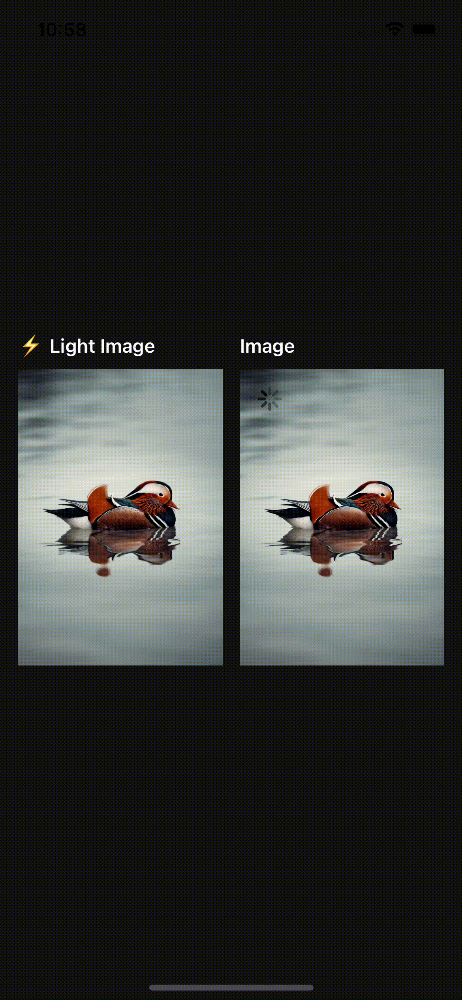

<h1 align="center">
  ⚡️ LightImage
</h1>

<div align="center">
Performant Expo image component.
</div>
<br/>

<p align="center">
  <kbd>
    
  </kbd>
  <br>
  <em>LightImage example</em>
</p>

## Usage

```bash
yarn add @appidia/expo-light-image

or

npm install @appidia/expo-light-image
```

```jsx
import LightImage from "@appidia/expo-light-image";

const YourImage = () => (
  <LightImage
    style={{ width: 200, height: 200 }}
    source={{
      uri: "https://unsplash.it/400/400?image=1",
    }}
  />
);
```